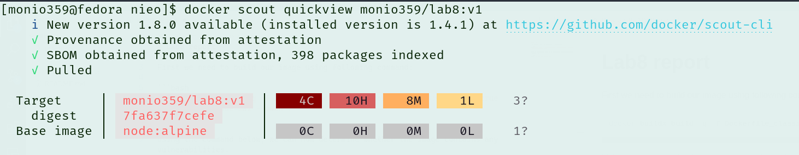
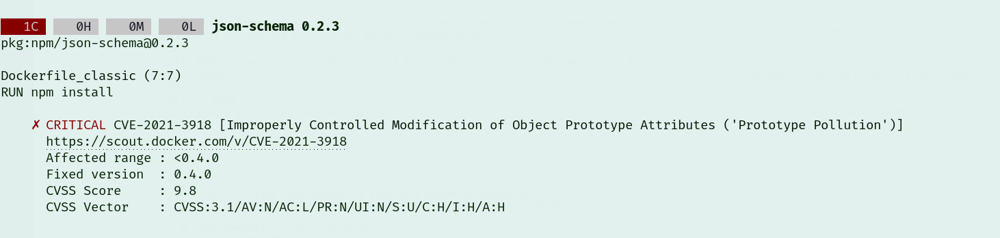
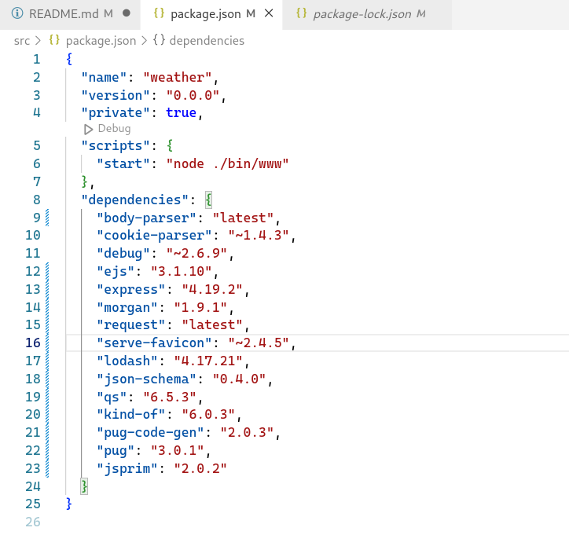
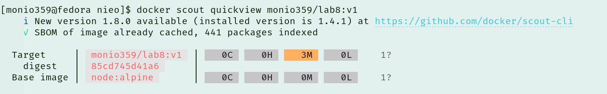

# Lab8 report

First we need to build our image using following command:

```bash
docker buildx build -q -f Dockerfile_classic -t monio359/lab8:v1 --sbom=true --provenance=mode=max --push .
```

Using the command below, we can now determine whether the image contains any vulnerabilities.

```bash
docker scout quickview monio359/lab8:v
```



What catches attention are 4 critical vulnerabilities and 10 high ones. Now I will present how to eliminate these vulnerabilities. 

Before starting to fix the errors, I will conduct a complete CVE analysis of the image. It allows identifying where individual security vulnerabilities originate from

```bash
docker scout cves monio359/lab8:v1
```


Many of the errors come from incorrect versions of JavaScript packages listed in the package.json file, so you'll need to update that file.

Updated package.json file:




CVS analys after rebuild image as we can see is no more high or critical vulnerabilities:

